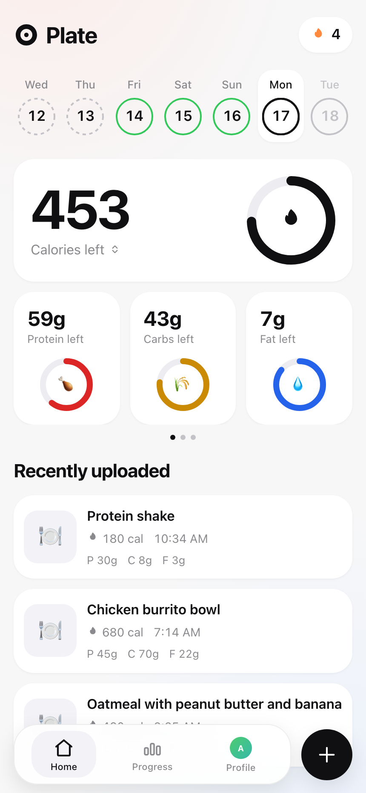
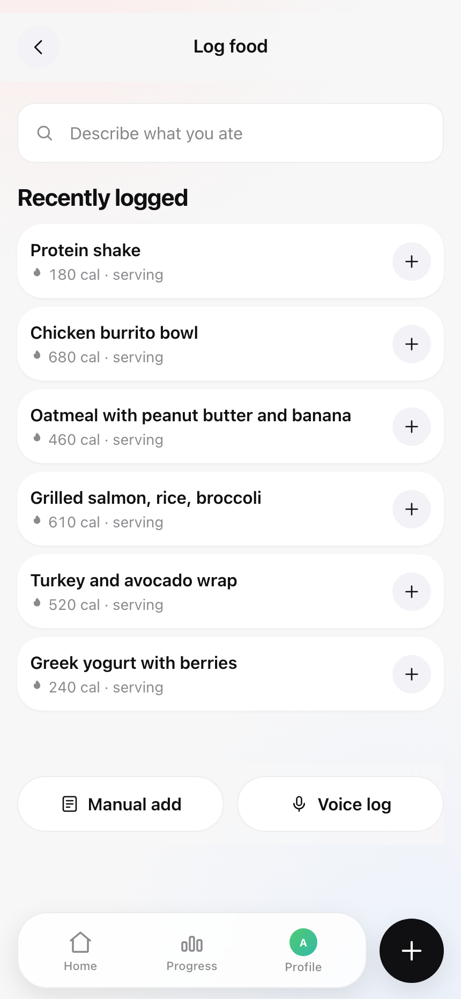
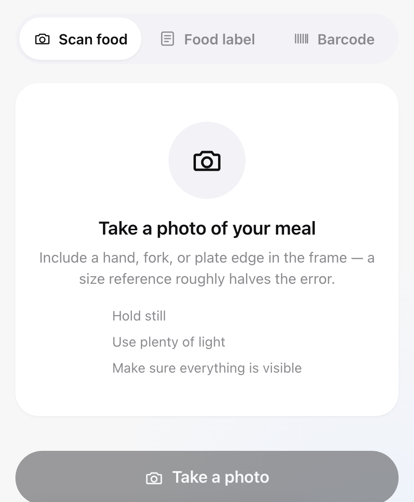
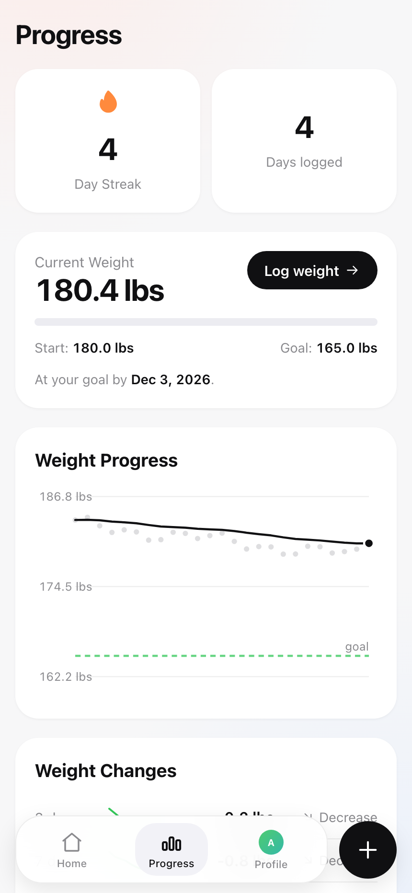

# Plate — self-hosted calorie tracker

## Why this exists

I was paying a monthly subscription for Cal AI to track calories. At some
point it clicked: underneath the subscription is a food database, some
arithmetic, a chart or two, and one AI call that turns a meal photo into a
list of ingredients. That's a couple of scripts, a database, and an image
analyzer — not something that needs to live behind someone else's server and
a recurring bill.

So I built the same idea for myself: log meals by photo, barcode, voice, or
search; get calorie and macro targets computed from your own numbers; watch
the trend, not just today's count. It runs on hardware you own, your food log
and photos never leave your server, and the only recurring cost is one you
control — an AI API key, and only if you want photo scanning at all.

## What it looks like

<table>
<tr>
<td></td>
<td></td>
</tr>
<tr>
<td align="center"><sub>Today's calories and macros, a day streak, and what you've logged</sub></td>
<td align="center"><sub>Search, manual entry, or voice — whatever's fastest in the moment</sub></td>
</tr>
<tr>
<td></td>
<td></td>
</tr>
<tr>
<td align="center"><sub>Photograph a meal and a vision model breaks it into ingredients</sub></td>
<td align="center"><sub>A trend line and a goal, not just a number that resets every midnight</sub></td>
</tr>
</table>

> **Not medical advice.** Targets come from population-level formulas with safety
> floors applied. They are not appropriate during pregnancy, for children, or with
> a history of disordered eating.

---

## What it does

- **Photo scanning** — a vision model identifies ingredients and estimates each
  one's weight in grams. You correct any weight and the totals recompute live.
- **Barcode scanning** — looked up against Open Food Facts, cached locally.
- **Food search** — works offline against a bundled database, no API key needed.
- **Manual entry** — always available, with a live sanity check on your macros.
- **Exercise and weight** — MET-based burn for runs and lifting, free-text via AI,
  or straight calorie entry. Weight uses a smoothed trend, not raw scale readings.
- **Progress** — weight trend, weekly energy, BMI, and an expenditure estimate
  measured from your own data rather than a formula.
- **Installable** — add to your home screen for a full-screen app.

## Requirements

- Node 22+ (or Docker) — `better-sqlite3`'s native binding requires it; older
  Node versions crash on first database access
- An Anthropic API key — **optional**. Without one, photo scanning and
  natural-language logging are disabled; everything else works.

---

## Quick start (Docker)

```bash
git clone https://github.com/ibrahimbisen/Plate.git && cd Plate
cp .env.example .env

# Optional — enables photo scanning
echo "ANTHROPIC_API_KEY=sk-ant-..." >> .env

docker compose up -d
```

Open `http://localhost:3000` — there's no sign-in step; see
["No built-in authentication"](#no-built-in-authentication) below before putting
this anywhere reachable beyond your own machine.

## Quick start (local)

```bash
npm install
cp .env.example .env

npm run dev
```

## Quick start (production, no Docker)

```bash
git clone https://github.com/ibrahimbisen/Plate.git && cd Plate
npm ci
cp .env.example .env
npm run build
npm run db:migrate
npm start -- -H 127.0.0.1 -p 3000
```

Keep it running with whatever process manager your host already uses, e.g. pm2:

```bash
pm2 start npm --name plate -- start -- -H 127.0.0.1 -p 3000
pm2 save
```

`output: 'standalone'` in `next.config.ts` exists for the Docker image's benefit (a slim
runtime without full `node_modules`) — running `next start` from a full checkout, as above,
doesn't use it and needs no extra copy step. Unlike `npm run dev`, nothing runs migrations for
you: `npm run db:migrate` is required before the first boot and after every schema change.
Point a reverse proxy or tunnel at whatever port you chose — see
["Putting it on your own domain"](#putting-it-on-your-own-domain) below.

---

## No built-in authentication

Plate has no login and no password. Anyone who can reach the server on the
network gets full access — your food log and, more sensitively, your meal and
body photos (served straight from `/api/photos/...` with no access check at
all). This is a deliberate simplicity trade-off for a single-user, personal
tool, not an oversight.

That's fine on a machine only you can reach (`localhost`, or a home LAN you
trust). Before putting it anywhere else, put something in front of it:

- A reverse proxy with HTTP basic auth (nginx `auth_basic`, Caddy
  `basicauth`), or
- A VPN/tunnel (Tailscale, WireGuard) so the port is never exposed publicly, or
- Your proxy's own auth layer (Cloudflare Access, Authelia, etc.)

Do not put this on the open internet with nothing in front of it.

## Putting it on your own domain

Two things matter.

**1. Serve it over HTTPS.** The barcode scanner needs `getUserMedia`, which
browsers only expose on a secure origin. Photo capture works either way (it uses
the file input), but plain HTTP means no live barcode scanning and no PWA install.

**2. Configure your reverse proxy for uploads and streaming.** nginx defaults to a
1 MB body limit, which every phone photo exceeds:

```nginx
location / {
    proxy_pass http://127.0.0.1:3000;
    proxy_http_version 1.1;
    client_max_body_size 20M;   # default is 1M -> 413 on every photo
    proxy_buffering off;        # required, or streaming responses stall
    proxy_set_header Host $host;
    proxy_set_header X-Forwarded-Proto $scheme;
}
```

Caddy, which handles TLS automatically:

```caddyfile
tracker.example.com {
    reverse_proxy 127.0.0.1:3000
    request_body { max_size 20MB }
}
```

---

## Configuration

Every variable is documented in [`.env.example`](.env.example). The ones that
matter:

| Variable | Required | Notes |
| --- | --- | --- |
| `ANTHROPIC_API_KEY` | no | Enables photo scan and voice parsing |
| `ANTHROPIC_MODEL` | no | Defaults to `claude-opus-5`; swap for a cheaper tier |
| `PHOTO_MAX_EDGE` | no | Downscale target, default 1568px |
| `STT_ENDPOINT` | no | Any OpenAI-compatible transcription endpoint |
| `OFF_CONTACT_EMAIL` | no | Sent to Open Food Facts, which asks clients to identify themselves |
| `DATABASE_PATH` | no | Defaults to `./data/app.db` |
| `UPLOAD_DIR` | no | Defaults to `./data/uploads` |

There are deliberately **no `NEXT_PUBLIC_*` variables**. Those are inlined into
the JavaScript bundle at build time, so a single published image would freeze
every self-hoster to whatever values it was built with.

---

## Backups

Everything lives under one directory — the SQLite database and your photos:

```bash
docker compose stop app
docker run --rm -v plate-data:/data -v "$PWD:/backup" \
  busybox tar czf /backup/plate-$(date +%F).tar.gz /data
docker compose start app
```

Stop the app first, or you may capture a WAL mid-write.

---

## How some of it works

A few decisions that are load-bearing and non-obvious:

**Photo estimates ask for grams, not calories.** Published evaluations put vision
models' portion-size error near 28%, under-estimated on ~76% of meals, while
ingredient *identification* is strong. So the model does the visual work and the
server does every calculation — which also means the grams are yours to correct.
Totals are shown as a range, and the weekly view is far more trustworthy than any
single meal.

**Every dated row stores a local civil date.** "Calories today" is a calendar
question, not a timestamp question — bucketing on UTC would put a late dinner on
tomorrow for anyone west of Greenwich.

**Log entries freeze their nutrition.** If a row stored only a foreign key, an
Open Food Facts contributor fixing a typo would silently rewrite your history.

**Expenditure is measured, not assumed.** The activity multipliers everyone uses
have no authoritative source. After ~2 weeks of data, the app estimates your real
expenditure from intake versus your weight trend and stops relying on the formula.

**Chart colours were validated, not chosen.** The obvious tan-vs-green pairing for
burned-vs-consumed is nearly identical under deuteranopia. The palette here was
checked for colour-vision separation before shipping.

---

## Data sources and licensing

- Product and barcode data from **[Open Food Facts](https://openfoodfacts.org)**,
  under the [Open Database License (ODbL)](https://opendatacommons.org/licenses/odbl/1-0/).
  Individual contents under DbCL; product images © their contributors under CC BY-SA.
- Generic whole foods from **USDA FoodData Central** (public domain).
- Health score from the published **Nutri-Score 2023** algorithm.

ODbL share-alike attaches to *the database*, not to this application's code. Your
personal food log is your data, not a derived database. If you redistribute a
modified copy of the Open Food Facts data itself, that copy must be ODbL too.

## Licence

Code is MIT — see [LICENSE](LICENSE). This project is not affiliated with,
endorsed by, or connected to any commercial calorie-tracking app.
